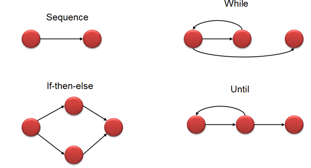

## Cyclomatic Complexity

### Introduction

Cyclomatic Complexity is a metric that can be used as a proxy for the complexity of a program.
Specifically, the metric measures the number of independent paths through a piece of software, i.e. how many different combinations of unique actions are made possible by the conditional statements of a program.

The concept of cyclomatic complexity is closely tied to the concept of a _program control graph_ which is a way to represent the structure of a computer program using directed graphs.
Each node of the graph represents a block of code that is executed sequentially, such assignment statements or performing arithmetic.
Nodes corresponding to conditionals causes the graph to split into different paths.

Conditional in C/C++ include:

- `if`, `if else`, and `else`
- `while`
- `do while`
- `switch`

A short summary of the different construct can be seen in the image below:



A simple example of the relation between code and the graph can be seen below:

```cpp
// form the maximal sum of a sequence of integers with upper limit
int max_sum(std::vector<int> values, int threshold)
{
   int sum = 0;

   for (auto &v: values)
   {
      if (v > 0)
      {
         sum += v;
      }
      else
      {
         // discard value
      }
   }

   if (sum > threshold)
   {
      sum = threshold;
   }
   else
   {
      // keep sum
   }
   return sum;
}
```

Results in a graph like:


The following formula can be used to calculate the cyclomatic complexity of the `max_sum_thresholded` function:

V(g) = number of edges - number of nodes + 2 \* number of connected components = 11 - 8 + 2 = 5

Comparing this with the number of linearly independent cycles we see that it is in fact the same:

{ [1,2,1], [2,3,2], [2,4,2], [1,5,6,8,1], [1,5,6,7,8,1] }.
